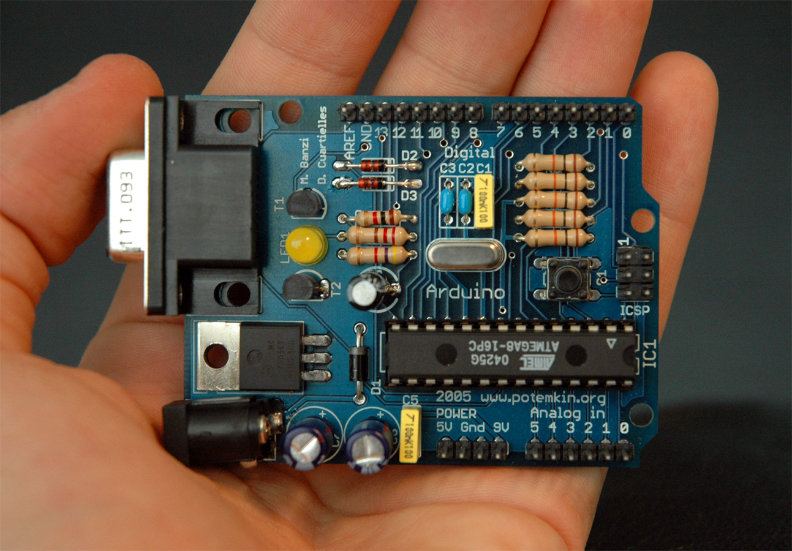
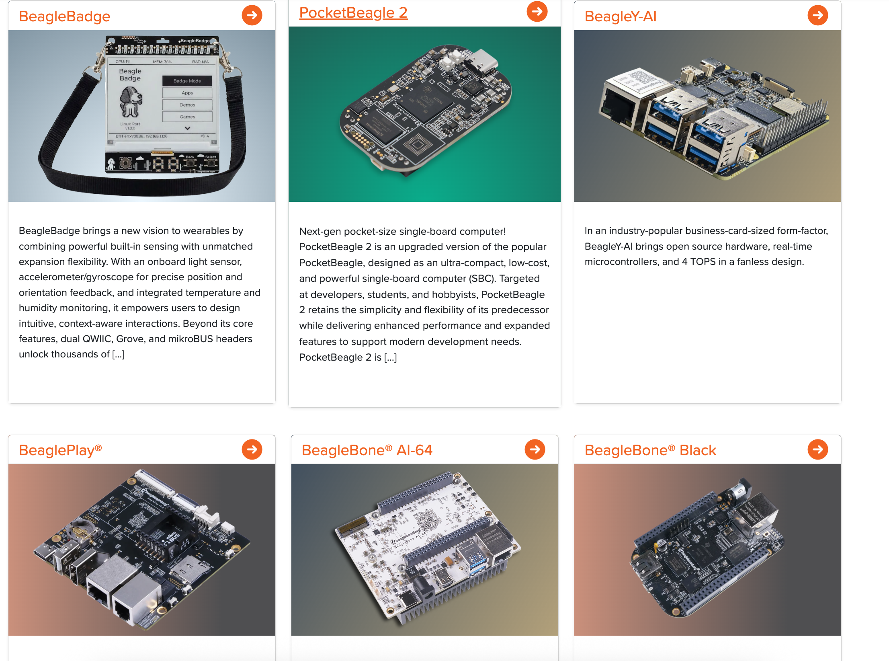

## Hardware de fuentes abiertas {.smaller}

::: {.fragment}
Es una **guía para el desarrollo y evaluación de licencias** que refiere a los **artefactos tangibles** máquinas, dispositivos, u otros objetos del mundo físico cuyo diseño ha sido publicado de forma tal que cualquier persona abiertamente pueda:
:::

::: {.incremental}

- **Ver** el diseño completo
- **Modificar** y adaptar el diseño
- **Fabricar** y distribuir copias, incluso con fines lucrativos.

:::

::: {.fragment}
**La Asociación de Hardware de Código Abierto (OSHWA)** es la organización que promueve este movimiento, organizando eventos y gestionando la certificación de hardware que cumple con estos principios.
:::

::: {style="text-align: center;"}
{fig-align="center"}](https://freedomdefined.org/upload/7/76/Oshw-logo.png){width="15%"}
:::

::: {.notes}
Analogía directa con el software libre, pero aplicado a objetos físicos. No implica gratuidad: implica libertad de acceso, modificación y fabricación.

incluye planos, esquemáticos, listas de materiales y, si aplica, el firmware/software. Para que se considere hardware abierto 

:::

---

## Antecedentes del Open Hardware:

::: {.incremental}
- **Raíces informales (1975)**: el *Homebrew Computer Club* en Silicon Valley, donde aficionados compartían libremente esquemáticos de microprocesadores
- **Primer intento formal (finales de los 90)**: el *Open Hardware Certification Program* de Bruce Perens, quien registró el término "open hardware"
- **Proyecto que lo popularizó (2005)**: **Arduino**, creado por un grupo de ingenieros para hacer accesible la electrónica programable.
:::

---

## Definición 1.0 de la OSHW  {.smaller}

La licencia OSHW obliga a clarificar que los productos no son manufacturados, vendidos, garantizados, o sancionados por el diseñador original y no usará alguna marca perteneciente al diseñador original. 

Los términos de distribución debe cumplir con:

:::: {.columns}

::: {.column width="50%" .incremental}
1. Documentación completa.
2. Alcance de la documentación.
3. Software necesario para funcionar.
4. Garantiza la libre modificación
5. Garantiza la libre distribución del diseño
6. Atribución
:::

::: {.column width="50%" .incremental}
7. No ser discriminatoria a personas.
8. Redistribución de la licencia sin permisos adicionales.
9. Licencia no es restringida a otro hardware o software
10. Debe ser neutral
:::

::::

::: {style="text-align: center;"}
[https://freedomdefined.org/OSHW](https://freedomdefined.org/OSHW)
:::

::: {.notes}
1. **Documentación**: El hardware debe publicarse con documentación y archivos de diseño en el formato preferido para hacer modificaciones (por ejemplo, el formato nativo de un programa CAD). No se permiten archivos ofuscados ni formas intermedias como el arte final de las pistas de cobre.
2. **Alcance**: La documentación debe especificar con claridad qué parte del diseño se libera bajo la licencia.
3. **Software necesario**: Si el diseño requiere software para funcionar, las interfaces deben estar documentadas lo suficiente para escribir software abierto, o el software debe liberarse con una licencia aprobada por la OSI.
4. **Obras derivadas**: La licencia debe permitir modificaciones y obras derivadas bajo los mismos términos, así como la fabricación, venta, distribución y uso de los productos y archivos de diseño.
5. **Libre redistribución**: La licencia no debe impedir vender o regalar la documentación, ni exigir regalías o cuotas por su venta o por la de obras derivadas.
6. **Atribución**: Atribución a los autores originales, 2. Que la atribución sea visible para quien usa el dispositivo La licencia puede exigir atribución a los licenciantes y que las obras derivadas lleven un nombre o versión distintos, sin imponer un formato de presentación específico.3. Cambiar el nombre o el número de versión en las obras derivadas

La licencia puede pedir que tu derivado no se llame igual que el original, o que al menos lleve otra versión.
7. **No discriminación contra personas o grupos**: La licencia no debe discriminar a ninguna persona o grupo.
8. **No discriminación contra campos de aplicación**: La licencia no debe restringir el uso de la obra en ningún campo específico (por ejemplo, uso comercial o investigación nuclear).
9. **Distribución de la licencia**: Los derechos deben aplicarse a todos los receptores sin necesidad de firmar una licencia adicional.
10. **La licencia no debe ser específica de un producto**: Los derechos no deben depender de que la obra forme parte de un producto en particular.
11. **La licencia no debe restringir otro hardware o software**: No puede imponer restricciones sobre otros elementos distribuidos junto con la obra que no sean derivados de ella.
12. **La licencia debe ser neutral tecnológicamente**: Ninguna disposición puede depender de una tecnología, componente, material o estilo de interfaz en particular. 

:::

---

## ¿Por qué es necesario?

::: {.incremental}
- **Reproducibilidad científica:** cualquier laboratorio puede replicar el instrumento exacto usado en un estudio
- **Reducción de costos:** elimina márgenes de propiedad intelectual en investigación y educación
- **Independencia tecnológica:** evita depender de un solo fabricante (vendor lock-in)
- **Aceleración de la innovación:** cada mejora se suma al acervo común en lugar de perderse
:::

---

## Ventajas vs Desventajas con respecto al hardware cerrado {.smaller}

:::: {.columns}

::: {.column width="50%" .fragment}
::: {style="text-align: center;"}
**Ventajas**
:::

- Transparencia de un aspecto del diseño
- Comunidad global que documenta, corrige y extiende el diseño
- Menor costo de entrada para educación e investigación
- Longevidad: si el fabricante desaparece, el diseño sigue vivo
- Fomenta economías locales (cualquiera puede fabricar)
:::

::: {.column width="50%" .fragment}

::: {style="text-align: center;"}
**Desventajas**
:::

- Soporte técnico fragmentado y no garantizado
- Calidad y control de manufactura más variables
- Curva de aprendizaje mayor para el usuario final
- Financiamiento y sostenibilidad del proyecto más inciertos
- Certificaciones regulatorias más difíciles de costear
:::

::::

---

## Electrónica y cómputo: Arduino{.smaller}

Es una **plataforma** de electrónica de código abierto (hardware y software libre) para facilitar, el estudio y prototipado rápido de proyectos con componentes interactivos. 

Se compone de:

* Hardware: Placas basadas en microcontroladores 
* Software: El Entorno de Desarrollo Integrado (IDE) para programar las placas mediante un lenguaje adaptado de C/C++
Emuladores: Software que imita el comportamiento del hardware para agilizar la fase de diseno. 

{fig-align="center" width="40%"}

---

## Electrónica y cómputo: Beagle Bone {.smaller}

La comunidad BeagleBoard.org desarrolla soluciones de computación física de código abierto, incluyendo robótica, herramientas de manufactura personal como impresoras 3D y cortadoras láser, y otros tipos de controles industriales y de maquinaria.

{fig-align="center"}

::: {style="text-align: center;"}
[BeagleBone Board](https://www.beagleboard.org/boards/beaglebone-black)
:::

---

## Electrónica y cómputo: RISC-V {.smaller}

Es un proyecto que propone un estandard abierto para el diseño de conjunto de instrucciones para microprocesadores RISC. 

::: {style="text-align: center;"}
](figuras/riscv.png){fig-align="center" width="50%"}
:::

::: {.notes}
La mayoría de los microprocesadores que implementan RISC-V tienen su diseño interno de silicio cerrado y patentado. Solo el conjunto de instrucciones que el chip es abierto, no el diseño físico del transistor hacia arriba.
:::

## Electrónica y cómputo: RISC-V {.smaller}

| Aspecto | RISC-V | ARM | x86 |
|---|---|---|---|
| Tipo | RISC | RISC | CISC |
| Licencia | **Abierta, sin regalías** | Propietaria (Arm Holdings) | Propietaria (Intel/AMD) |
| Control | RISC-V International (no-profit) | Arm Holdings | Intel / AMD |
| Extensiones custom | **Permitidas por diseño** | Limitadas | No |  

Empresas que hacen microprocesadores RISC-V:  

* SiFive. 
* AMD. 
* Andes Technology

---

## Manufactura digital: RepRap

"RepRap es la primera maquina autoreplicante de proposito general en la humanidad"

::: {style="text-align: center;"}
](figuras/reprap.jpg){fig-align="center" width="20%"}
:::

::: {.notes}
RepRap es la primera máquina de fabricación de propósito general capaz de autorreplicarse: una impresora 3D de escritorio, libre y de código abierto, que imprime muchas de sus propias piezas para que cualquiera pueda armar otra. Nació como proyecto comunitario para hacer disponibles estas máquinas a todos, y dio inicio a la revolución de la impresión 3D de código abierto. En 2017 fue votada como el objeto impreso en 3D más significativo, y su creador, Adrian Bowyer, recibió reconocimientos como el premio a la Contribución Sobresaliente a la Impresión 3D y, en 2019, el título de MBE.
:::

---

## Agricultura: Farmbot {.smaller}

 Es una plataforma abierta de agricultira de precisión basada en un robot agricultor de coordanadas cartesianas, software y documentación que incluyendo un repositorio de datos agrículas. El proyecto tiene como objetigo crear una tecnología abierta y accesible para apoyar a cualquier persona a la producción de alimentos agrícolas.

::: {style="text-align: center;"}
](figuras/farmbot.png){fig-align="center" width="40%"}
:::

---

## Agricultura: LibreIncu {.smaller}

Es un proyecto Argentino impulsado desde AlterMundi y la Comunidad, Trabajo y Organización (CTO) para desarrollar la infraestructura tecnológica comunitaria (equipos, software y sensores como la "LibreIncu") que permita a la Agricultura Familiar, Campesina e Indígena reproducir pollitos y recuperar razas camperas de forma autosuficiente y ecológica.

::: {style="text-align: center;"}
](figuras/libreincu.png){fig-align="center" width="40%"}
:::

---

## Salud: E-nable. {.smaller}

Es una comunidad global de unos 40,000 voluntarios en más de 100 países que imprimen en 3D prótesis de mano y brazo gratuitas o económicas, con diseños de código abierto. Han beneficiado a entre 10,000 y 15,000 personas, sobre todo en comunidades con poco acceso a atención médica.

::: {style="text-align: center;"}
](https://i0.wp.com/enablingthefuture.org/wp-content/uploads/2015/12/e-NABLE_Shopping.jpg?resize=600%2C228&ssl=1){fig-align="center"}
:::

---

## Robótica: OpenROV {.smaller}

Fué una compañía dedicada en democratizar la exploración submarina. Hoy es una comunidad de aficionados y profesionales que construyen sus propios submarinos OpenROV en más de 30 países, para explorar subacuátia. Los foros de OpenROV (archivados en 2015 en la Wayback Machine) ofrecen un espacio para intercambiar ideas, resolver problemas y compartir información. Además, los usuarios pueden documentar sus construcciones, proyectos y despliegues en la plataforma Open Explorer.

::: {style="text-align: center;"}
](https://upload.wikimedia.org/wikipedia/commons/5/5e/OpenROV-Xeopesca-Praza_P%C3%BAblica_2.jpg?utm_source=en.wikipedia.org&utm_campaign=imageinfo&utm_content=thumbnail_unscaled){fig-align="center" width="40%"}
:::

---

## Robótica: Poppy {.smaller}

Poppy es una plataforma de código abierto para crear, usar y compartir objetos robóticos interactivos, para principiantes, expertos en educación, ciencia y arte, con el fin de aprender y compartir ideas sobre tecnologías digitales. Su tecnología combina modelos de hardware de código abierto (licencia CC-BY-SA), una biblioteca de software libre en Python llamada Pypot, y un sitio web comunitario (poppy-project.org) con documentación, tutoriales, simuladores y espacio para contribuir a la plataforma.

::: {style="text-align: center;"}
](https://www.generationrobots.com/19293-product_cover/poppy-humanoid-robot-raspberry-pi-version-with-3d-parts.jpg){fig-align="center" width="40%"}
:::

::: {.notes}
Aquí tienes el resumen traducido al español:

Poppy es una plataforma de código abierto para crear, usar y compartir objetos robóticos interactivos, dirigida tanto a principiantes como a expertos en educación, ciencia, arte y, en general, makers. Fue diseñada como herramienta de aprendizaje para desarrollar y compartir ideas sobre tecnologías digitales.

La tecnología de Poppy se compone de tres elementos: modelos de hardware de código abierto (con licencia CC-BY-SA), una biblioteca de software libre llamada Pypot basada en Python, y un sitio web comunitario (poppy-project.org) donde cualquiera puede acceder a documentación, tutoriales, software y simuladores, además de contribuir a mejorar la plataforma.
:::

---

## Movilidad: Open Source Car Architecture Research, OSCAR: {.smaller}

 es un proyecto con el objetivo de crear un estándar abierto y colaborativo del chasis de vehículos para ahorrar costos, facilitar la homologación e involucrar a toda la cadena de desarrollo. 

Su misión es reducir los costos de desarrollo, disminuir las barreras de homologación y permitir que todas las empresas de la cadena de valor del desarrollo de vehículos participen.

::: {style="text-align: center;"}
](figuras/oscar.png){width="40%"}
:::

::: {.notes}
OSCAR se fundó para colocar la colaboración por encima de la competencia, reuniendo a personas y empresas de distintos orígenes y perspectivas. Su chasis modular y sus arquitecturas abiertas permiten que cada actor integre sus componentes, participe en el avance del proyecto y se convierta en parte de la comunidad.
:::

---

## {.center style="text-align: center; font-size: 3em;"}

¡Gracias!

